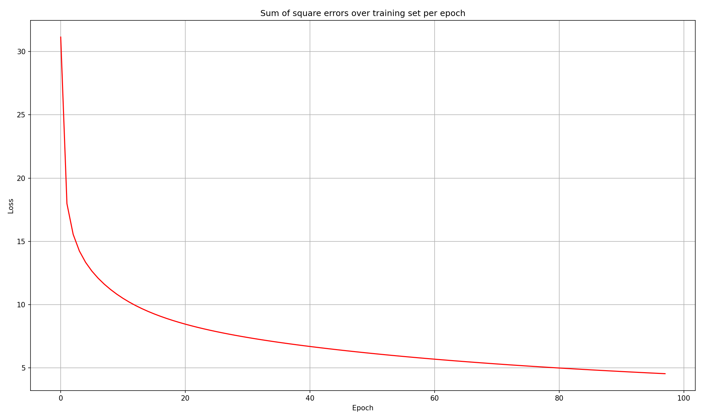

# eakpython
## Multilayer Perceptron (MLP) from Scratch

A pure Python/NumPy implementation of a Multilayer Perceptron, built from the ground up to demystify the core concepts of Neural Networks.

#### Overview

This project involves building a Multi-Layer Perceptron network from scratch without using pre-defined machine learning libraries and packages in Python. I believe that by building the model and training it from scratch, one can understand the processes within a neural network more deeply. Concepts like backpropagation, the effects of hyperparameters, and activation functions can be understood more profoundly and better.

The model is demonstrated and evaluated on the classic **Breast Cancer Wisconsin Dataset** from `scikit-learn`.

#### Results for 50 Neurons and 0.1 Learning Rate

| Metric | Value |
|--------|-------|
| Train Accuracy | 99.34% |
| Test Accuracy | 95.61% |

#### Future Improvements 

The next improvements for the code will be:

*   More result visualizations (confusion matrix, etc.)
*   Implementing more than one hidden layer
*   Visualizing the effects of modifying each of the hyperparameters on the result
*   Support for common activation functions

