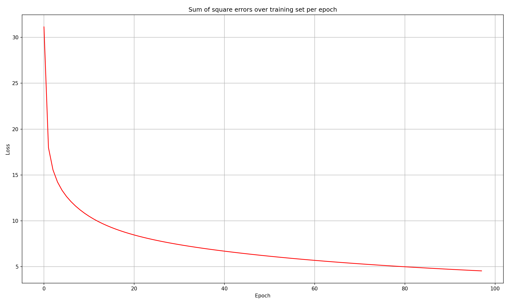
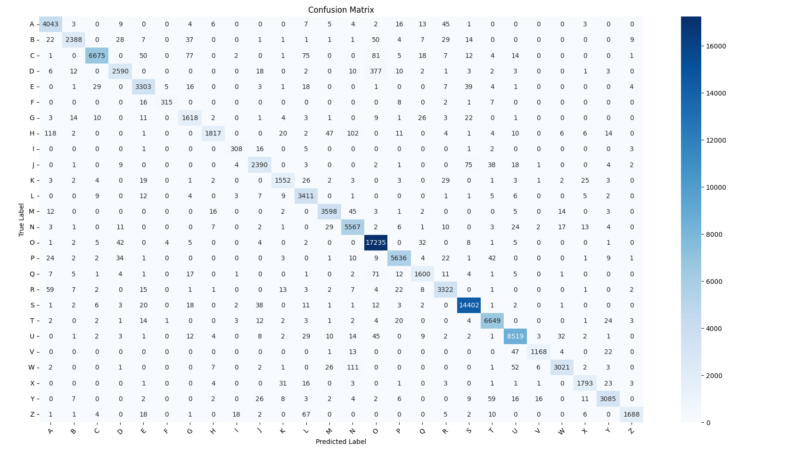

# eakpython
## 1- Multilayer Perceptron (MLP) from Scratch

A pure Python/NumPy implementation of a Multilayer Perceptron, built from the ground up to demystify the core concepts of Neural Networks.

#### Overview

This project involves building a Multi-Layer Perceptron network from scratch without using pre-defined machine learning libraries and packages in Python. I believe that by building the model and training it from scratch, one can understand the processes within a neural network more deeply. Concepts like backpropagation, the effects of hyperparameters, and activation functions can be understood more profoundly and better.

The model is demonstrated and evaluated on the classic **Breast Cancer Wisconsin Dataset** from `scikit-learn`.

#### Results for 50 Neurons and 0.1 Learning Rate

| Metric | Value |
|--------|-------|
| Train Accuracy | 99.34% |
| Test Accuracy | 95.61% |

#### Future Improvements 

The next improvements for the code will be:

*   More result visualizations (confusion matrix, etc.)
*   Implementing more than one hidden layer
*   Visualizing the effects of modifying each of the hyperparameters on the result
*   Support for common activation functions

## 2- Fully Connected Neural Network for Handwritten A_Z Classification

A PyTorch-based implementation of a fully connected neural network trained on a large-scale handwritten alphabet dataset, accelerated with CUDA for GPU computation.

### Overview
This project implements a simple yet effective fully connected neural network using PyTorch, designed to classify handwritten English letters (A–Z). 
The model is trained on the A_Z Handwritten Alphabet Dataset, a widely used dataset containing thousands of 28×28 grayscale images of handwritten letters.
The code also supports CUDA, enabling GPU-accelerated training when available.
You can download the dataset from [this](https://www.kaggle.com/datasets/sachinpatel21/az-handwritten-alphabets-in-csv-format) page. 

The network consists of:

* An input layer of 784 features (flattened 28×28 images)

* A hidden layer with 50 ReLU-activated neurons

* An output layer with 26 neurons (one for each alphabet class)

After training, the model consistently achieves over 90% accuracy on both the training and test splits, confirming the effectiveness of this simple architecture.

### Future Improvements 
Some possible enhancements for future versions of the project:
* Add real-time or batch visualizations (confusion matrix, misclassified samples, etc.)
* Explore other activation functions or regularization strategies
* Extend the pipeline to CNN architectures for image-specific feature extraction

## 3- Convolutional Neural Network for Handwritten A_Z Classification

### Overview
A PyTorch-based CNN trained on the A_Z Handwritten Alphabet Dataset, featuring multi-layer convolution, max-pooling, and GPU-accelerated training for high-accuracy letter recognition.

The network consists of:

* 2 convolutional layers with kernel size 5, each followed by a max-pooling layer

* a fully connected layer with 10 neurons

* An output layer with 26 neurons (one for each alphabet class)

After training, the model consistently achieves over 90% accuracy on both the training and test splits, confirming the effectiveness of this simple architecture.
The confusion matrix obtained after 15 epochs of training:
